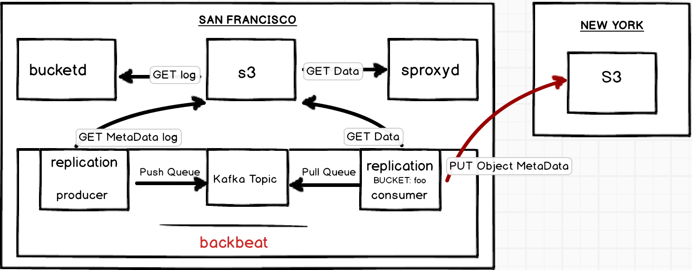
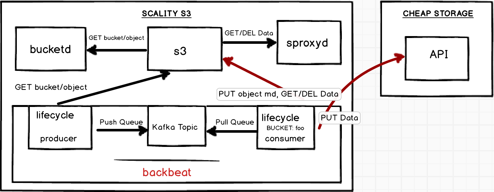
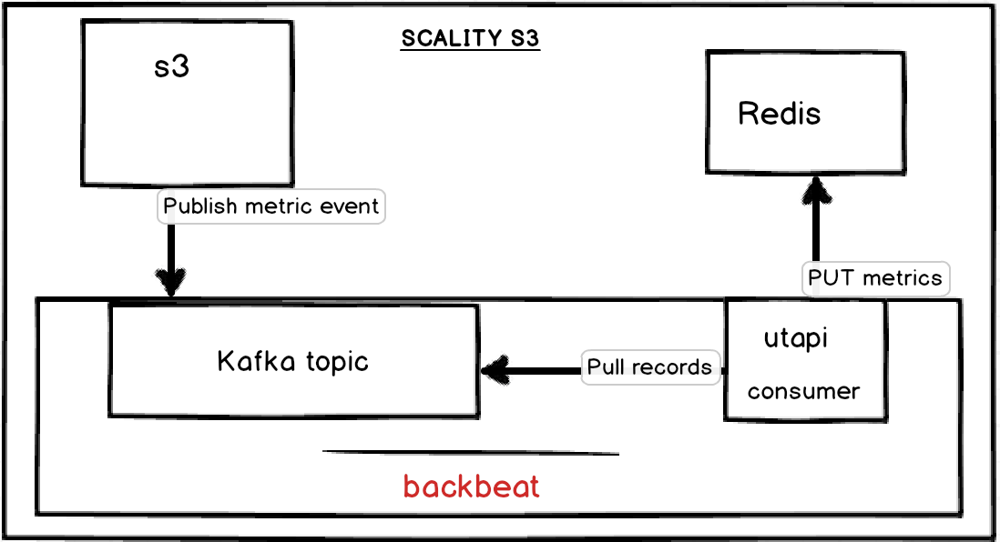

# Design

## CONSIDERATIONS

* **Containerized:** It lives in its own container
* **Distributed:** There will be 3-5 instances per site for HA. If one of the
    instances dies, the queue replica from another instance can be used to
    process the records
* **Extensions:** To achieve features like replication, lifecycle etc.
    extensions can be written for the core engine
* **Backend agnostic:** For V1, all interactions will go through S3. This way we
    are not restricted to one backend and we can reuse existing solutions for
    different backends. S3 would expose separate routes on a non-advertised port
    intended only for Backbeat
* **Background Jobs:** Backbeat will include a background process which runs on
    a crontab schedule. For example, the process "wakes up" at a set time and
    gets a list of buckets, gets attributes for a bucket, checks lifecycle
    policy, checks object metadata for tags if tags are used in a policy and
    then applies the lifecycle action to the matched objects
* **Multi-threaded:** Using Kafka's KeyedMessage mechanism, multiple consumers
    can process entries in parallel achieving high throughput

## DESIGN OVERVIEW

### DEPLOYMENT (Mono/Multi-site)

The nodes of a Backbeat cluster must live within one given datacenter. Ideally
there will be one standalone cluster per site. Each cluster may have 3-5
instances for HA.

Backbeat will be the backbone of features like active/active or active/passive
replication which rely on such local services to perform remote actions. The
basis of replication relies on versioning, Metadata and Data propagation from
site to site, which does not need the message queue to be shared between sites
(and we don’t want that either because the internals of Backbeat are not
necessarily geo-aware: e.g. Zookeeper for Kafka).

### KAFKA

Kafka is used as a queue manager for Backbeat.

#### PROS

* Distributed, Pub/Sub, Simple to use, durable replicated log.
* Fast reads and writes using sequential reads/writes to disk.
* Topics contain partitions which are strictly ordered.
* Replication is done on partition level and can be controlled per partition.
* More than one consumer can process a partition achieving parallel processing.
* Can have one consumer processing real time and other consumer processing in
    batch.
* Easy to add a large number of consumers without affecting performance.
* We can leverage stream processing for encryption, compression etc.

#### CONS

* Uses Zookeeper but it’s not in the critical path
* Needs optimization for fault tolerance
* Not designed for high latency environments (the cluster can be restricted to
    majority site for multisite deployments)

## APPLYING BACKBEAT

### USING BACKBEAT FOR REP.1 (Active/Passive replication)

For Cross Region Replication (CRR), we can use Backbeat to replicate the
objects asynchronously from a bucket of one region to the other. The design
highlights how CRR can be achieved by using Backbeat.
Reference: AWS rules of what is and what is not replicated
http://docs.aws.amazon.com/AmazonS3/latest/dev/crr-what-is-isnot-replicated.html

* For V1, all replication actions go through S3. S3 exposes routes for Metadata
    and Data backends to Backbeat.
* MetaData journal is used as the source of truth.
* Object metadata will have a new property, `replicationStatus`. When a CRR
    configuration is enabled on a bucket, any S3's PUT metadata operations on
    objects matching the configuration will have `replicationStatus` as
    `PENDING`.
* A producer (background job) wakes up, let’s say every `n` seconds, requests
    journal from Metadata starting from a sequenceId. The producer then queues
    entries from the journal which have `replicationStatus` PENDING into Kafka.
* The entries contain the sequence number as key and a stringified json with
    fields like action (PUT), object key, object metadata.
* Backbeat will leverage Kafka's KeyedMessage mechanism, which guarantees all
    records with the same key, lets say `<bucket name>:<object key>` are written
    into the same partition and ordering of records is guaranteed within a
    partition. This gives the advantage of the ability to balance records across
    all the Kafka nodes and the assignment of multiple consumers to process the
    queue.
* A consumer picks up from the last committed offset and processes one entry at
    a time. The consumer first copies data to the target site, updates the
    object's metadata with the new location, sets the replicationStatus to
    `REPLICA` and writes the metadata entry at the target. Once the metadata
    and data operations are completed on the target bucket, the object's
    metadata in source bucket is updated to reflect replicationStatus as `COMPLETED`.

* If there has been any failure in these sequence of operations for an entry
    then the object metadata on the source is updated with replicationStatus
    `FAILED`. The consumer will commit the offset of the last successful entry
    processed to Kafka. On the next run, this entry is tried again.

### USING BACKBEAT FOR ILM.1 (Object Lifecycle Management)

When a lifecycle configuration is enabled on a bucket, objects that match the
configuration are tiered/expired per life cycle rules.

Object Lifecycle Management can be achieved through Backbeat as follows:
All lifecycle actions go through S3. S3 exposes hot path routes for MetaData
and Data backends to Backbeat.
A lifecycle producer wakes up, let’s say every 24 hours and gets a list of
buckets from S3.
The producer then walks through each bucket, if the bucket has life cycle
configuration, it gets object metadata matching the config and makes an entry
in the lifecycle Kafka topic (topic:lifecycle).
The entry would contain fields like nature of operation (PUT/DEL), object
metadata.
All entries go into a topic with keys being partitioned automatically by Kafka.
Multiple consumers would then be started processing the records in the topic.
The consumers are responsible for tiering/deleting the data and
updating/deleting object metadata according to the action.
High throughput is achieved by using multiple consumers running in parallel
working on the lifecycle topic.

### USING BACKBEAT FOR UTAPI.3

Backbeat can be used to avoid loss of metrics in Utapi due to Redis downtime or
other issues.

The push metric process of Utapi can be re-designed as follows to avoid loss of
metrics.
S3 successfully processes an api request and publishes to the push metric
channel (topic:utapi) with the metrics details.
A consumer wakes up every few minutes, let’s say every 5 minutes, processes
records in the topic and publishes the metrics for persistent storage in Redis.
If Redis is down, the metrics are retried at a later time.
Ordering of records doesn’t matter as it evens out once all the records are
applied. So multiple consumers can be used to process the topic records in
parallel.

## SECURITY

* AWS uses IAM roles with IAM policies to gain access to buckets for CRR,
    Lifecycle actions and follows a similar path of how they provide
    third-party access to AWS resources. This setup can be translated to our use
    case as follows.

* Use PKI certificates with TLS for trusted communication between the services
    Backbeat and Vault.
    On all the sites(SF, NY, Paris for example), communication to Vault occurs
    through a private route by establishing a TCP connection using the PKI
    certificates.

* Vault will be pre-configured with a user called scality-s3. This user is will
    have no credentials (access key, secret key pair) assigned by default and
    will be used by Backbeat.

* A trust policy (IAM actions) will be created allowing the user to assume the
    role to gain temporary credentials to the source/destination accounts’
    resources.
* Cross account permissions can be managed using Bucket ACLs.
    Access policies (S3 actions) will be created allowing the “role” to perform
    specific actions to achieve CRR or Lifecycle actions.
    Backbeat first requests temporary credentials from Vault through the private
    route intended for Backbeat after establishing a trusted communication
    connection using the certificates. Vault creates temporary credentials for
    the user scality-s3 assuming the “role” which can be stored by Vault in
    Redis.
    Temporary credentials expire every few hours(or some set time) in
    Redis emulating STS. These credentials will be used to communicate with S3
    for performing life cycle, replication actions.

* Backbeat would renew credentials from Vault when they expire.
    Temporary credentials don’t span across the sites, so Backbeat has to renew
    credentials on all the sites individually.
* The above setup is inline with AWS’ behavior, security practices and it would
    not require us to re-invent the wheel. Benefits are that we don’t hardcode
    any credentials in Backbeat and roles, policies are transparent to the
    customer who can see what actions we are using for replication or
    lifecycle. Customers are not expected to maintain or alter these policies,
    they will be managed by Scality at deploy time.

## OSS LICENSES

* Kafka and Zookeeper are the only dependencies of Backbeat which are licensed
    under Apache License 2.0.
* `kafka-node` npm module which will be used for the producer/consumer actions
    is licensed under MIT license.

## STATISTICS FOR SLA, METRICS etc

There are two ways we can approach this.
Pub/Sub events can be used in addition to the MetaData log in a separate topic
(let’s call it statistics). The records in this topic can be leveraged by
comparing to the active queue to generate statistics like
RPO (Recovery Point Objective)
RTO(Recovery Time Objective)
Storage backlog in bytes
Storage replicated so far in bytes
Number of objects in backlog
Number of objects replicated so far etc.
Use a decoupled topic in addition to the queue topic. This will be managed by
the producers/consumers adding records for non-replicated and replicated
entries. Since each entry would have a sequence number, calculating the
difference between the sequence numbers of the latest non-replicated and
replicated records would give us the required statistics.
