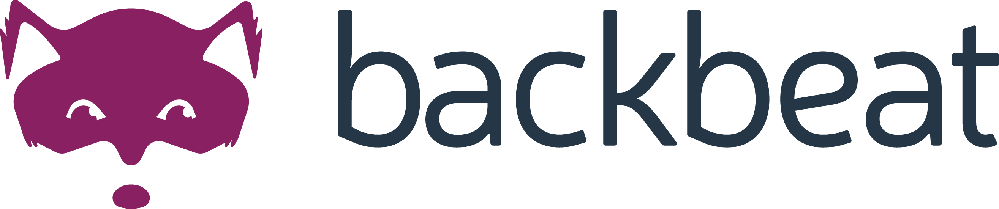

# Zenko Backbeat

## OVERVIEW

Backbeat is an engine with a messaging system at its heart.
It's part of Zenko, [Scality](http://www.scality.com/)’s
Open Source Multi-Cloud Data Controller.
Learn more about Zenko at [Zenko.io](http://www.zenko.io/)

Backbeat is optimized for queuing metadata updates and dispatching work
to long-running tasks in the background.
The core engine can be extended for many use cases,
which are called extensions, as listed below.

## EXTENSIONS

### Asynchronous Replication

This feature replicates objects from one S3 bucket to another S3
bucket in a different geographical region. The extension uses the
local Metadata journal as the source of truth and replicates object
updates in a FIFO order.

## DESIGN

Please refer to the ****[Design document](/DESIGN.md)****
